# TileServer GL - Project Architecture

Complete technical documentation for understanding and forking this project commercially.

---

## Table of Contents

1. [Project Overview](#project-overview)
2. [System Architecture](#system-architecture)
3. [Express Architecture Patterns](#express-architecture-patterns)
4. [Source Files Reference](#source-files-reference)
5. [Complete Routes & Endpoints](#complete-routes--endpoints)
6. [Request Flow](#request-flow)
7. [Configuration System](#configuration-system)
8. [Middleware Stack](#middleware-stack)
9. [Logging System](#logging-system)
10. [Security Analysis](#security-analysis)
11. [Quick Reference](#quick-reference)

---

## Project Overview

**TileServer GL** is a map tile server built on Express.js that:

- Serves **vector tiles** (PBF format) from MBTiles or PMTiles sources
- Renders **raster tiles** (PNG/JPG/WebP) server-side using MapLibre GL Native
- Serves **MapLibre GL styles** with automatic source URL rewriting
- Provides **elevation data** endpoints (Terrarium and Mapbox encodings)
- Generates **static map images** with overlays (markers, paths)
- Supports **remote data sources** (HTTP, HTTPS, S3 for PMTiles)

### Technology Stack

| Component | Technology | Purpose |
|-----------|------------|---------|
| Web Framework | Express.js 5.x | HTTP server and routing |
| Tile Rendering | @maplibre/maplibre-gl-native | Server-side raster rendering |
| Image Processing | Sharp | Image format conversion |
| Canvas Rendering | node-canvas | Overlay rendering (markers, paths) |
| Data Sources | @mapbox/mbtiles, pmtiles | Tile data storage formats |
| Coordinate Utils | @mapbox/sphericalmercator | Tile coordinate conversions |
| Logging | pino, pino-http, pino-roll | Structured logging with rotation |
| CLI | Commander | Command-line argument parsing |

### Node.js Requirements

- **Node.js 20, 22, or 24** (specified in `package.json` engines)

### Development Approach

**Docker is recommended** for development and deployment due to native dependencies (canvas, maplibre-gl-native) that can cause environment-specific issues when running with npm directly.

---

## System Architecture

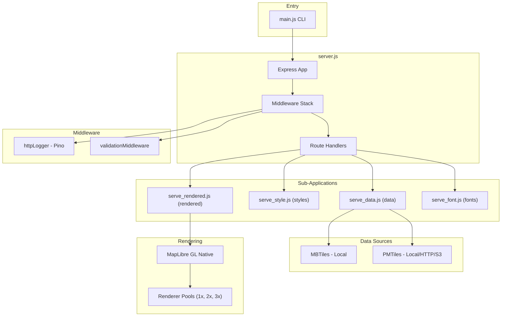

---

## Express Architecture Patterns

### Server Initialization

The server initializes Express with security-first defaults:
- `disable('x-powered-by')` - Hides backend stack from response headers
- `enable('trust proxy')` - Trusts X-Forwarded-* headers from proxies

### Why `disable('x-powered-by')`?

| Without disable | With disable |
|-----------------|--------------|
| Response includes `X-Powered-By: Express` | Header is omitted |
| Attackers know you use Express | Technology stack hidden |
| They can target Express-specific CVEs | Harder to fingerprint server |

### Why `enable('trust proxy')`?

When behind a load balancer (AWS ALB, Cloudflare, Nginx), this allows:
- `req.ip` → Real client IP (not load balancer IP)
- `req.protocol` → Original protocol
- `req.hostname` → Original host

**Important:** Only enable if behind a trusted proxy.

### Sub-Apps Architecture

Each sub-app is a separate Express application mounted at a specific path:

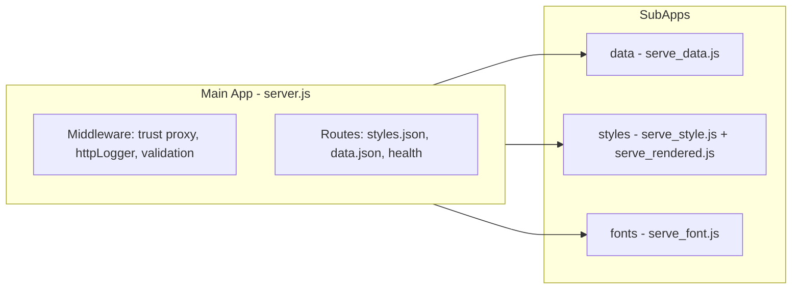

**Benefits of sub-apps:**
- **Modularity:** Each module handles its own routes
- **Isolation:** Middleware in sub-apps doesn't affect main app
- **Testability:** Each sub-app can be tested independently

---

## Source Files Reference

### Entry Points

#### `src/main.js` - CLI Entry Point

**Purpose:** CLI entry point and server initialization

**Key Responsibilities:**
- Parse command-line arguments with Commander
- Auto-detect `.mbtiles` or `.pmtiles` files in current directory
- Load configuration from `config.json` or create auto-config
- Start the Express server

**CLI Options:**

| Option | Default | Description |
|--------|---------|-------------|
| `--file <file>` | - | MBTiles or PMTiles file (local or remote) |
| `-c, --config <file>` | `config.json` | Configuration file |
| `-b, --bind <address>` | - | Bind address |
| `-p, --port <port>` | `8080` | Server port |
| `-C, --no-cors` | CORS enabled | Disable CORS headers |
| `-u, --public_url <url>` | - | Public URL for subpath hosting |
| `-V, --verbose [level]` | - | Verbose output (1-3) |
| `-s, --silent` | - | Less verbose output |
| `--fetch-timeout <ms>` | `15000` | HTTP fetch timeout |

---

#### `src/server.js` - Main Server

**Purpose:** Express server setup, route mounting, style/data loading

**Key Responsibilities:**
- Initialize Express app with middleware
- Load configuration and resolve paths
- Mount sub-apps for data, styles, fonts
- Load styles and data sources from config
- Serve web UI templates (Handlebars)
- Handle server lifecycle (start, shutdown, reload)

**Architecture Overview:**

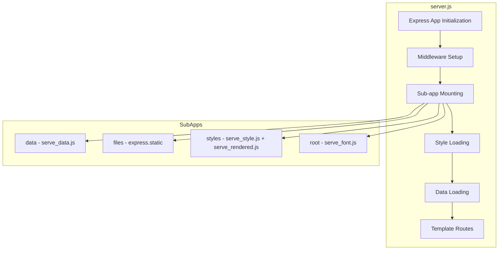

**Key Functions:**

| Function | Purpose |
|----------|---------|
| `start(opts)` | Initialize and configure Express app |
| `addStyle(id, item, ...)` | Load and configure a map style |
| `serveTemplate(urlPath, template, dataGetter)` | Serve Handlebars templates |
| `addTileJSONs(arr, req, type, tileSize)` | Build TileJSON responses |
| `server(opts)` | Exported server startup function |

---

### Core Modules

#### `src/serve_data.js` - Vector Tile & Elevation Data

**Purpose:** Serve raw vector tiles and elevation data

**Routes:**

| Method | Route | Purpose |
|--------|-------|---------|
| GET | `/:id/:z/:x/:y.:format` | Serve vector tile |
| GET | `/:id/elevation/:z/:x/:y` | Single point elevation |
| POST | `/:id/elevation` | Batch elevation query |
| GET | `/:id.json` | TileJSON metadata |

**Sparse Tile Handling:**
- `sparse=true` → Returns 404 for missing tiles (allows overzooming)
- `sparse=false` → Returns 204 for missing tiles (prevents overzooming)

---

#### `src/serve_rendered.js` - Raster Tile Rendering

**Purpose:** Render raster tiles and static images using MapLibre GL Native

**URL Patterns:**

| Pattern | Example | Purpose |
|---------|---------|---------|
| `/:id/:z/:x/:y.:format` | `/styles/basic/10/512/384.png` | 256px tile |
| `/:id/512/:z/:x/:y.:format` | `/styles/basic/512/10/512/384.png` | 512px tile |
| `/:id/static/:lon,:lat,:zoom/:wx.:h@:scale.:format` | `/styles/basic/static/8.5,47.3,12/600x400@2x.png` | Static image |
| `/:id/static/auto/:wx.:h.:format` | `/styles/basic/static/auto/600x400.png?marker=...` | Auto-bounds image |

**Renderer Pool System:**

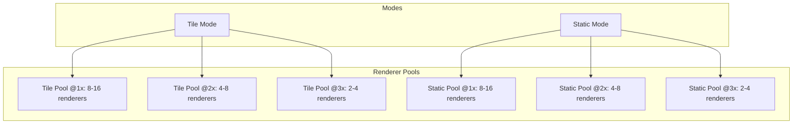

---

#### `src/serve_style.js` - Style JSON & Sprites

**Purpose:** Serve style.json files and sprite assets

**Routes:**

| Method | Route | Purpose |
|--------|-------|---------|
| GET | `/:id/style.json` | Serve style JSON |
| GET | `/:id/sprite{/:spriteID}{@:scale}{.:format}` | Serve sprite assets |

**URL Rewriting:** Converts source URLs to `local://` protocol for internal resolution.

---

#### `src/serve_font.js` - Font Serving

**Purpose:** Serve font PBF files for text rendering in maps

**Routes:**

| Method | Route | Purpose |
|--------|-------|---------|
| GET | `/fonts/:fontstack/:range.pbf` | Serve font PBF |
| GET | `/fonts.json` | List available fonts |

---

#### `src/render.js` - Canvas Overlay Rendering

**Purpose:** Render overlays (paths, markers), watermarks, and attribution using node-canvas

**Overlay Types:**
- **Paths:** Styled polylines via query parameters
- **Markers:** Icon markers with scaling and offset
- **Watermarks:** Text overlay on rendered images
- **Attribution:** Attribution box on static images

---

### Data Source Adapters

#### `src/pmtiles_adapter.js` - PMTiles Support

**Purpose:** Read tiles from PMTiles files (local, HTTP, HTTPS, S3)

**Supported URLs:**
- Local file: `/path/to/file.pmtiles`
- HTTP: `http://example.com/tiles.pmtiles`
- HTTPS: `https://example.com/tiles.pmtiles`
- S3: `s3://bucket/path/file.pmtiles`

---

#### `src/mbtiles_wrapper.js` - MBTiles Support

**Purpose:** Read tiles from MBTiles files (local only)

---

### Utility Modules

#### `src/app.config.js` - Centralized Configuration

**Purpose:** Centralized configuration loaded from environment variables

**Configuration Structure:**

| Section | Setting | Source | Default |
|---------|---------|--------|---------|
| auth | baseUrl | `AUTH_BASE_URL` env | `''` |
| auth | timeout | hardcoded | `5000ms` |
| cors | isCheckAllowedOrigins | `IS_CHECK_ALLOWED_ORIGINS` env | `true` |
| validation | skipExtensions | hardcoded | `.css, .ico, .png, .jpg, .svg, .ttf` |
| validation | skipPaths | hardcoded | `/, /health` |

---

#### `src/utils.js` - Utility Functions

**Key Functions:**

| Function | Purpose |
|----------|---------|
| `getPublicUrl(publicUrl, req)` | Get base URL for responses |
| `getTileUrls(req, tiles, path, tileSize, format, publicUrl, aliases)` | Generate tile URLs |
| `fixTileJSONCenter(tileJSON)` | Fix center array format |
| `isValidHttpUrl(url)` | Check if HTTP/HTTPS URL |
| `isValidRemoteUrl(url)` | Check if HTTP/HTTPS/S3 URL |
| `fetchTileData(source, sourceType, z, x, y)` | Fetch tile from any source |
| `getFontsPbf(...)` | Concatenate font PBFs |
| `listFonts(fontPath)` | List available fonts |
| `allowedTileSizes(size)` | Validate tile size (256 or 512) |
| `allowedScales(scale, maxScale)` | Validate scale factor |
| `lonLatToTilePixel(lon, lat, z, tileSize)` | Convert coords to tile pixels |

---

#### `src/logger.js` - Structured Logging

**Purpose:** Pino-based structured logging with HTTP middleware and daily log rotation

See [Logging System](#logging-system) section for details.

---

## Complete Routes & Endpoints

### Main Server Routes (server.js)

| Method | Route | Handler | Purpose |
|--------|-------|---------|---------|
| GET | `/styles.json` | inline | List all available styles |
| GET | `/:tileSize/rendered.json` | inline | TileJSON for rendered tiles |
| GET | `/data.json` | inline | TileJSON for all data sources |
| GET | `/:tileSize/index.json` | inline | Combined TileJSON index |
| GET | `/` | `serveTemplate` | Front page (index.tmpl) |
| GET | `/styles/:id/` | `serveTemplate` | Style viewer (viewer.tmpl) |
| GET | `/styles/:id/wmts.xml` | `serveTemplate` | WMTS capability document |
| GET | `/data/:view/:id/` | `serveTemplate` | Data preview (data.tmpl) |
| GET | `/health` | inline | Health check endpoint |

### Data Routes (serve_data.js → `/data/`)

| Method | Route | Purpose |
|--------|-------|---------|
| GET | `/data/:id/:z/:x/:y.:format` | Serve vector tile |
| GET | `/data/:id/elevation/:z/:x/:y` | Single point elevation |
| POST | `/data/:id/elevation` | Batch elevation query |
| GET | `/data/:id.json` | TileJSON metadata |

### Style Routes (serve_style.js → `/styles/`)

| Method | Route | Purpose |
|--------|-------|---------|
| GET | `/styles/:id/style.json` | Serve style JSON |
| GET | `/styles/:id/sprite{/:spriteID}{@:scale}{.:format}` | Serve sprite assets |

### Rendered Routes (serve_rendered.js → `/styles/`)

| Method | Route | Purpose |
|--------|-------|---------|
| GET | `/styles/:id/:z/:x/:y.:format` | 256px raster tile |
| GET | `/styles/:id/:tileSize/:z/:x/:y.:format` | Custom size raster tile |
| GET | `/styles/:id/static/:staticType/:size@:scale.:format` | Static map image |
| GET | `/styles/:id.json` | TileJSON for rendered |

### Font Routes (serve_font.js → `/`)

| Method | Route | Purpose |
|--------|-------|---------|
| GET | `/fonts/:fontstack/:range.pbf` | Serve font PBF |
| GET | `/fonts.json` | List available fonts |

### Static Routes

| Mount | Source | Purpose |
|-------|--------|---------|
| `/` | `public/resources/` | MapLibre GL, Leaflet, etc. |
| `/files/` | `paths.files` | User static files |

---

## Request Flow

### Complete Request Flow

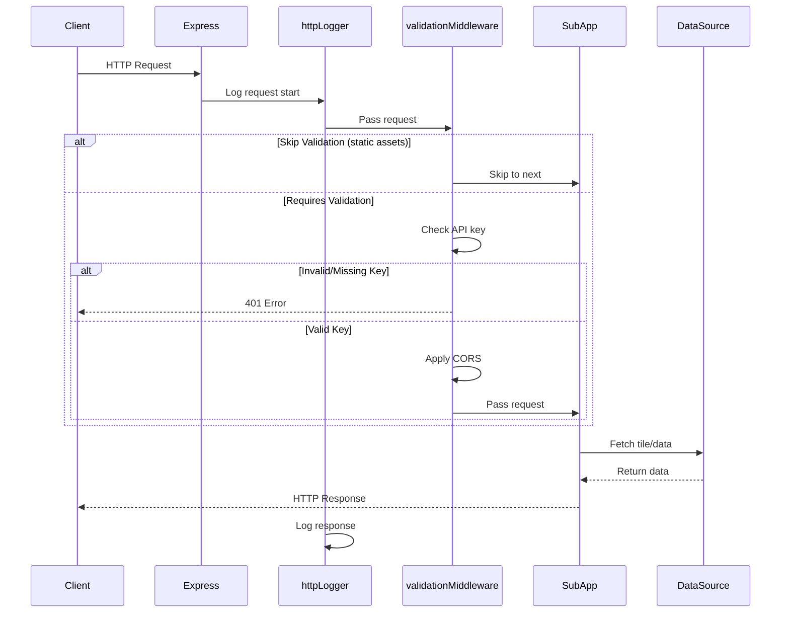

### Tile Request Flow

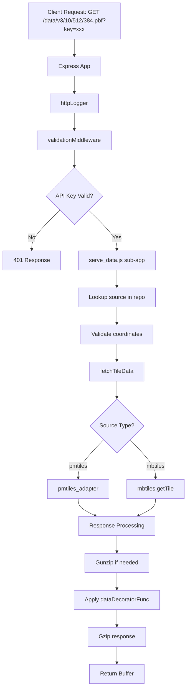

### Rendered Tile Request Flow

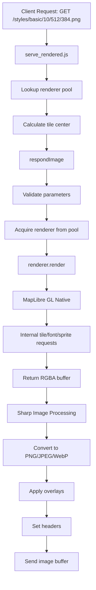

### Style Loading Flow

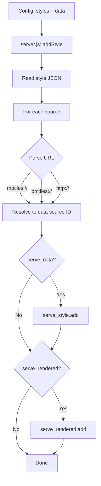

---

## Configuration System

### config.json Structure

| Section | Purpose |
|---------|---------|
| `options` | Server configuration (paths, quality, pool sizes) |
| `styles` | Map style definitions |
| `data` | Data source definitions |

**Options Configuration:**

| Option | Type | Description |
|--------|------|-------------|
| `paths` | object | Path configuration for styles, fonts, sprites, data |
| `pbfAlias` | string | Alias for PBF format |
| `maxScaleFactor` | number | Maximum scale factor (default: 3) |
| `maxSize` | number | Maximum tile size (default: 2048) |
| `serveAllStyles` | boolean | Serve all styles in styles directory |
| `sparse` | boolean | Default sparse setting for tiles |
| `formatQuality` | object | JPEG/WebP quality settings |
| `formatOptions` | object | PNG/JPEG/WebP format options |
| `minRendererPoolSizes` | array | Minimum renderers per scale [@1x, @2x, @3x] |
| `maxRendererPoolSizes` | array | Maximum renderers per scale |
| `tileMargin` | number | Tile margin for rendering |
| `dataDecorator` | string | Path to data decorator module |

### Data Source Options

| Option | Type | Description |
|--------|------|-------------|
| `mbtiles` | string | Path to MBTiles file (local only) |
| `pmtiles` | string | Path or URL to PMTiles (local, HTTP, S3) |
| `s3Profile` | string | AWS profile for S3 PMTiles |
| `s3Region` | string | AWS region for S3 PMTiles |
| `requestPayer` | boolean | S3 requester pays |
| `s3UrlFormat` | string | S3 URL format override |
| `sparse` | boolean | Allow overzooming on missing tiles |
| `encoding` | string | Elevation encoding: `terrarium` or `mapbox` |
| `tileSize` | number | Tile size (256 or 512) |

### Style Options

| Option | Type | Default | Description |
|--------|------|---------|-------------|
| `style` | string | required | Path to style.json |
| `serve_data` | boolean | true | Serve style.json endpoint |
| `serve_rendered` | boolean | true | Serve rendered tiles |
| `tilejson` | object | {} | TileJSON overrides |
| `watermark` | string | - | Watermark text |
| `staticAttributionText` | string | - | Attribution on static images |
| `mapping` | object | {} | Map source names to data IDs |

---

## Middleware Stack

### Current Stack (in order)

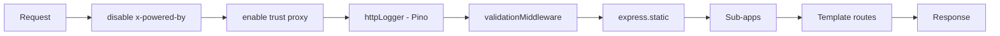

### Middleware Details

| Order | Middleware | Location | Purpose | Security Implication |
|-------|------------|----------|---------|---------------------|
| 1 | `disable('x-powered-by')` | server.js | Hide backend stack | Prevents server fingerprinting |
| 2 | `enable('trust proxy')` | server.js | Trust X-Forwarded-* headers | ⚠️ Only safe behind trusted proxy |
| 3 | `httpLogger` | server.js | Structured HTTP request logging | Uses pino-http |
| 4 | `validationMiddleware` | server.js | API Key validation + CORS | ✅ Protects non-public routes |
| 5 | Sub-apps | server.js | Route handling | Each has own middleware |

### Validation Middleware

**Purpose:** API Key validation with external service and CORS handling

**Features:**
- Timeout protection (5s) for API key validation
- Request-scoped logging via `req.log` from pino-http
- CORS middleware creation based on validation response
- Configurable skip paths for static assets

**Validation Flow:**

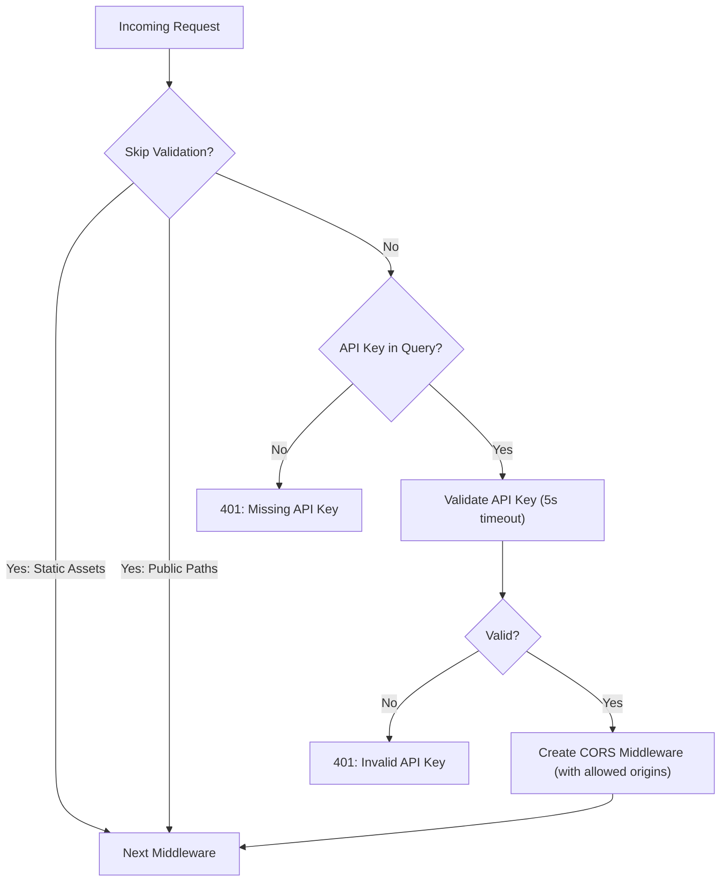

**Public Paths (no validation):**

| Type | Paths |
|------|-------|
| Extensions | `.css`, `.ico`, `.png`, `.jpg`, `.svg`, `.ttf` |
| Exact Paths | `/`, `/health` |

**Wildcard Origin Patterns (like Mapbox):**

| Pattern | Matches |
|---------|---------|
| `https://*.example.com` | `https://app.example.com`, `https://www.example.com` |
| `https://example.com/*` | `https://example.com/map`, `https://example.com/admin/dashboard` |
| `https://*.example.com/*` | Any subdomain with any path |

**API Endpoint Required:**
- Endpoint: `GET {AUTH_BASE_URL}/api/validation?api_key={key}`
- Response: `{ "is_valid": true, "allowed_origins": ["https://domain1.com"] }`

---

## Logging System

### Architecture Overview

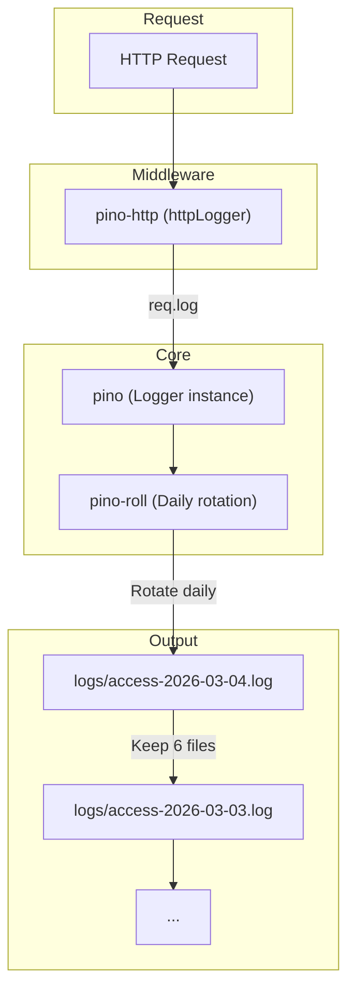

### Features

| Feature | Description |
|---------|-------------|
| Structured Logging | JSON log format via pino |
| HTTP Middleware | Automatic request/response logging via pino-http |
| Daily Rotation | New log file per day via pino-roll |
| File Retention | Keeps last 6 log files |
| Request-Scoped Logging | `req.log` available in all middleware/handlers |
| Custom Log Levels | Based on HTTP status codes |

### Log Level Rules

| Status Code | Log Level |
|-------------|-----------|
| 2xx, 3xx | `info` |
| 4xx | `warn` |
| 5xx | `error` |

### Standardized Error Messages

| Status | Message |
|--------|---------|
| 401 | Missing API Key |
| 403 | CORS policy: Origin not allowed |
| 5xx | Server Error |
| Success | Request Completed |

**Integration with Validation Middleware:**
- Validation middleware sets `res.locals.errorMessage` for custom messages
- httpLogger reads this for consistent log messages

### Log File Location

- Directory: `logs/`
- Filename pattern: `access-YYYY-MM-DD.log`
- Example: `logs/access-2026-03-04.log`

---

## Security Analysis

### Current Security Measures

| Measure | Location | Status |
|---------|----------|--------|
| Hide X-Powered-By | server.js | ✅ Implemented |
| Trust Proxy | server.js | ⚠️ Enabled (configurable) |
| API Key Authentication | middleware/validation.js | ✅ Implemented |
| CORS with Origin Control | middleware/validation.js | ✅ Wildcard pattern support |
| Input Sanitization | Multiple | ✅ Removes `\n\r` |
| Path Sanitization | serve_rendered.js | ✅ Uses sanitize-filename |
| Bounds Validation | serve_data.js | ✅ Validates tile coords |
| Sprite Path Sanitization | serve_style.js | ✅ Removes `../` |
| Request Timeout | middleware/validation.js | ✅ 5s timeout for API validation |

### API Key Authentication

- **Parameter:** `?key=xxx` query parameter
- **Protected routes:** All except public paths
- **Public routes:** `/`, `/health`, and static assets (`.css`, `.ico`, `.png`, `.jpg`, `.svg`, `.ttf`)

### Origin Validation

- All allowed origins come from the validation API response
- Supports wildcard patterns like `https://*.example.com`
- No fallback to environment variables - API response is single source of truth

---

## Quick Reference

### Development with Docker (Recommended)

Docker is the recommended way to develop and run this project to avoid environment-specific issues with native dependencies (canvas, maplibre-gl-native).

**Prerequisites:**
- Docker installed
- `.env` file configured (copy from `.env.example`)

**Environment Variables (.env):**

| Variable | Description | Example |
|----------|-------------|---------|
| `TZ` | Timezone | `Asia/Dhaka` |
| `AUTH_BASE_URL` | Base URL for validation API | `http://host.docker.internal:5010` |
| `IS_CHECK_ALLOWED_ORIGINS` | Set to `false` to allow all origins | `true` |

**Docker Commands:**

```bash
# Build and start
docker-compose up --build

# Run in background
docker-compose up -d --build

# View logs
docker-compose logs -f

# Stop
docker-compose down
```

**Docker Configuration:**

| Setting | Value |
|---------|-------|
| Image | `tileserver-gl:local` |
| Port | `8080:8080` |
| Volume | `.` → `/data` |
| Memory Limit | `8G` |

**Local Development with External Auth Service:**

For connecting to a local auth service running outside Docker:
- Set `AUTH_BASE_URL=http://host.docker.internal:5010`
- `host.docker.internal` resolves to the host machine from inside the container

### Start Server (Native)

```bash
# With config file
node src/main.js -c config.json -p 8080

# With single mbtiles file
node src/main.js --file switzerland.mbtiles

# With remote PMTiles
node src/main.js --file https://example.com/tiles.pmtiles

# With options
node src/main.js -c config.json -p 8080 --verbose 2 --cors
```

### Key Environment Variables

| Variable | Description |
|----------|-------------|
| `NODE_ENV` | Environment (development, production, test) |
| `PORT` | Override default port |
| `BIND` | Override bind address |
| `UV_THREADPOOL_SIZE` | Thread pool size (auto-calculated) |
| `AUTH_BASE_URL` | Base URL for validation API |
| `IS_CHECK_ALLOWED_ORIGINS` | Set to `false` to allow all origins |
| `TZ` | Timezone for logs |

### Test Commands

```bash
npm test                    # Run all tests
npm run test-docker         # Run tests with xvfb
npm run test:visual:generate  # Generate visual fixtures
```

### Lint Commands

```bash
npm run lint:js             # Check JS/JSON
npm run lint:js:fix         # Auto-fix
npm run lint:yml            # Check YAML
```
